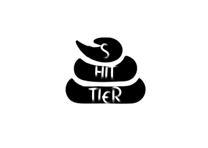

<p align="center">
  
</p>

Shittier is a Python library designed to intentionally degrade the readability and maintainability of code. It is perfect for creating obfuscated, confusing, and "shitty" code for educational purposes, pranks, or testing code analysis tools. Shittier is lightweight, easy to use, and compatible with many other languages when used as a concept.

## Features

- Adds random multi-line comments to code.
- Renames variables and functions to random strings.
- Inserts unnecessary spaces and dummy assignments.
- Includes unused imports and random function calls.
- Modifies code structure to make it harder to read.
- Supports batch file transformation.

## Installation

### 1. User Installation
```bash
pip install shittier
```

### 2. Developer Installation
```bash
git clone https://github.com/jaywyawhare/Shittier.git
cd Shittier
python setup.py install
```

For more information, see the [documentation](#).

---

## Usage

### 🛠️ Command-Line Interface (CLI)

You can use the CLI to obfuscate Python files:

```bash
python main.py filename.py
```

#### 💡 **Additional Options**:

- **Multiple files:**
  ```bash
  python main.py file1.py file2.py
  ```
- **All Python files in a directory (non-recursive):**
  ```bash
  python main.py .
  ```
- **All Python files recursively in a directory:**
  ```bash
  python main.py -r .
  ```
- **Output to a separate file (`.shittier.py` suffix added):**
  ```bash
  python main.py filename.py --output
  ```

---

### 🧑‍💻 Programmatic Usage

You can also transform Python code inside your scripts:

```python
from src.code_transformer import shittify_code

source_code = '''
def example_function(x, y):
    return x + y
'''

shitty_code = shittify_code(source_code)
print(shitty_code)
```

---

## 🧪 Running Tests

To ensure everything is working, run:

```bash
python -m unittest discover -s tests
```

---

## 🤝 Contributing

We welcome contributions from the community! If you'd like to contribute to Shittier, please follow our [Contribution Guidelines](CONTRIBUTING.md).

---

## 📜 License

This project is licensed under the [DBaJ-NC-CFL](./LICENSE).
